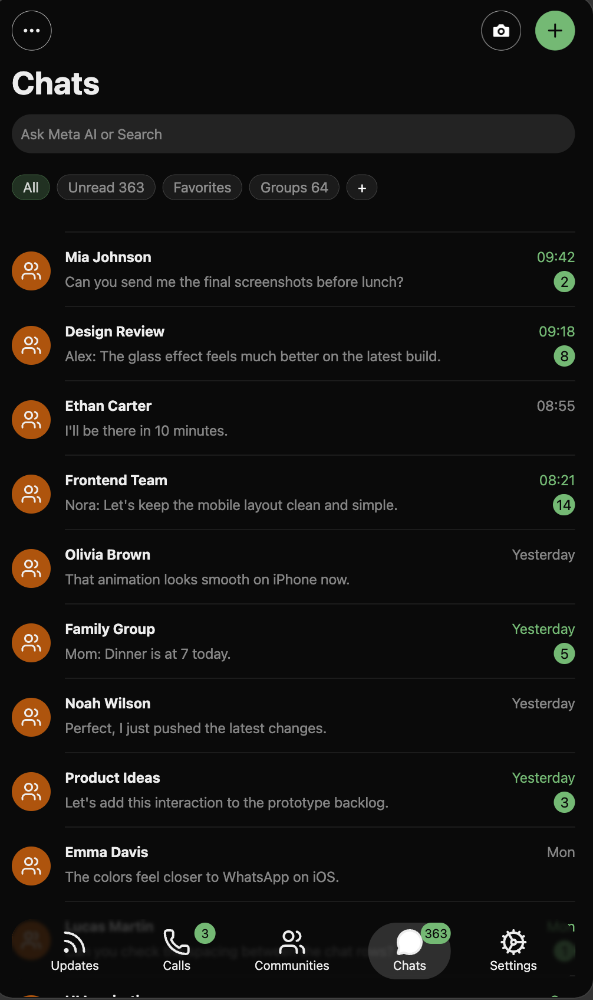

# WhatsApp iOS UI

A static mobile-first UI inspired by WhatsApp on iOS, built as a visual practice project focused on UI accuracy, layout structure, and attention to detail.

The goal of this project is not to build a functional messaging app, but to recreate the visual experience of WhatsApp as closely as possible using a minimal set of libraries and clean front-end practices.

## Live Demo

https://whatsapp-ui.ursoft.com.do

## About The Project

I built this project to challenge my eye for UI and see how well I could organize a front-end project from scratch while keeping the stack simple.

The interface was developed in approximately 4-6 hours, focusing on:

- Mobile-first layout
- iOS-inspired visual style
- WhatsApp-like spacing and hierarchy
- Static chat list UI
- Footer navigation
- Header actions
- Filter pills
- Notification badges
- Subtle glass effects
- Clean component structure
- Minimal dependencies

This is a static UI showcase. It does not include authentication, messaging, APIs, database logic, or real-time functionality.

## Preview

<p align="center">
  
</p>

## Tech Stack

- Next.js
- React
- TypeScript
- Tailwind CSS
- Lucide React
- Biome

## Features

- Static WhatsApp-inspired mobile UI
- Chat list with mock conversations
- Responsive mobile layout
- Bottom navigation menu
- Header action buttons
- Filter buttons with horizontal scroll
- Notification counters
- Truncated long messages
- iOS-like dark visual style
- Minimal reusable UI components

## Project Structure

```txt
src/
  app/
    globals.css
    layout.tsx
    page.tsx

  components/
    layout/
      footer/
      main/
      header.tsx
      index.ts

    ui/
      container.tsx
      counter.tsx
      icon-button.tsx
      index.ts

  lib/
    utils.ts
```

## Getting Started

Clone the repository:

```bash
git clone https://github.com/YOUR_USERNAME/whatsapp-ui.git
cd whatsapp-ui
```

Install dependencies:

```bash
npm install
```

Run the development server:

```bash
npm run dev
```

Open the app:

```txt
http://localhost:3000
```

## Available Scripts

```bash
npm run dev
```

Start the development server.

```bash
npm run build
```

Create a production build.

```bash
npm run start
```

Start the production server.

```bash
npm run lint
```

Run Biome checks.

```bash
npm run lint:fix
```

Run Biome checks and apply fixes.

```bash
npm run format
```

Check formatting with Biome.

```bash
npm run format:fix
```

Format files with Biome.

## Design Notes

This project intentionally avoids heavy UI libraries. Most of the interface is built with simple components, Tailwind utilities, and small reusable primitives.

The main focus was visual craftsmanship:

- Consistent spacing
- Clean typography hierarchy
- Rounded mobile UI elements
- Proper text truncation
- Compact navigation
- Mobile viewport behavior
- Simple but readable component composition

## Disclaimer

This project is not affiliated with, endorsed by, or connected to WhatsApp, Meta, or any of their products.

It is a personal open-source UI recreation built for educational and portfolio purposes only.

## License

MIT License.

You are free to use, study, modify, and share this project.
